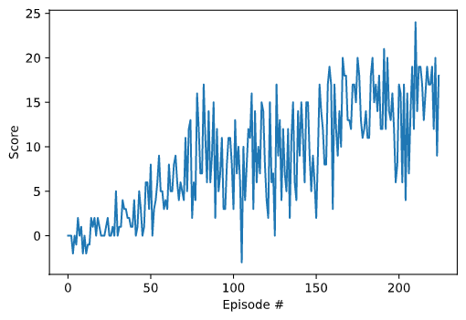

# Report
---
This project utilized the coding exercise for Deep Q-Networks algorithm, as outlined in the notebook [`solution/Deep_Q_Network_Solution.ipynd`](https://github.com/udacity/deep-reinforcement-learning/blob/master/dqn/solution/Deep_Q_Network_Solution.ipynb) to train an agent to navigate (and collect bananas!) in a large, square world.

A reward of +1 is provided for collecting a yellow banana, and a reward of -1 is provided for collecting a blue banana. Thus, the goal of the agent is to collect as many yellow bananas as possible while avoiding blue bananas.

The state space has 37 dimensions and contains the agent's velocity, along with ray-based perception of objects around the agent's forward direction. Given this information, the agent has to learn how to best select actions. Four discrete actions are available, corresponding to:
- `0` - move forward 
- `1` - move backward
- `2` - turn left
- `3` - turn right

The task is episodic, and in order to solve the environment, the trained agent must get an average score of +13 over 100 consecutive episodes.

# Learning algorithm

The agent training utilized Deep Q-Learning algorithm. 
This alogorithm uses a neural network to approximate the Q-value function.

A Q-value function helps us to find the optimal action under certain state. The optimal Q-value function gives us maximum rewards from a given state-action pair.
I use Adam optimizer to optimize the Q-value function which is the neural network here.

During the training stage, an action is selected by the epsilon-greedy stratagy. With the probability epsilon, we select a random action `a` and with probability 1-epsilon, we select an action that has a maximum Q-value, such as `a = argmax(Q(s,a,w))`.

The implementation of dqn_agent is contained in [`dqn_agent.py`](dqn_agent.py). 

### Hyper Parameters using in dqn_agent.py

- BUFFER_SIZE (int): replay buffer size
  - `BUFFER_SIZE = int(1e6)`
- BATCH_SIZ (int): mini batch size
  - `BATCH_SIZE = 256`
- GAMMA (float): discount factor
  - `GAMMA = 0.99`
- TAU (float): for soft update of target parameters
  - `TAU = 1e-3`
- LR (float): learning rate for optimizer
  - `LR = 0.0001`
- UPDATE_EVERY (int): how often to update the network
  - `UPDATE_EVERY = 2`

The buffer size and batch size is suitable for the machine with large memory such as 32GB which is used in my machine. 
GAMMA and TAU are the default values implemented for the coding exercise of Deep Q-Networks algorithm. 
Learning rate and update every are set by trial and error.

### Neural network model architecture
The [Q-Network model](model.py) consists of 1 input layer, 2 hidden layers and 1 output layer.

- Input layer: the size depends on the state_size which is 37
- 2 Hidden layers: fully connected layers of 32 cells with Relu activation
- Output layer: the size depends on the action_size which is 4

### Other Hyper Parameters of Deep Q-Learning 

- n_episodes (int): maximum number of training episodes
  - `n_episodes=1000` 
- max_t (int): maximum number of timesteps per episode
  - `max_t=15000`
- eps_start (float): starting value of epsilon, for epsilon-greedy action selection
  - `eps_start=0.8`
- eps_end (float): minimum value of epsilon
  - `eps_end=0.001`
- eps_decay (float): multiplicative factor (per episode) for decreasing epsilon
  - `eps_decay=0.97`

the maximum number episodes and timesteps are set to relatively larger numbers in order to avoid early stopping.

The epsilon-greedy values were found via trial and error and avoid it decay to the minimum value too fast.

# Plot of Rewards



```
Episode 100	Average Score: 4.22
Episode 200	Average Score: 11.28
Episode 225	Average Score: 13.01
Environment solved in 125 episodes!	Average Score: 13.01
```

# Ideas for Future Work

This project used the basic Deep Q-Learning algorithm which has many limitations. Several improvements to the basic Deep Q-Learning algorithm is suggested in the course.

- Double DQN
  - Deep Q-Learning tends to overestimate action values. Double Q-Learning has been shown to work well in practice to help with this.

- Prioritized experience replay
  - Deep Q-Learning samples experience transitions uniformly from a replay memory. Prioritized experienced replay is based on the idea that the agent can learn more effectively from some transitions than from others, and the more important transitions should be sampled with higher probability.

- Dueling DQN
  - Currently, in order to determine which states are (or are not) valuable, we have to estimate the corresponding action values for each action. However, by replacing the traditional Deep Q-Network (DQN) architecture with a dueling architecture, we can assess the value of each state, without having to learn the effect of each action.

- Besides the above 3 extensions, many more have been proposed, including:
   - Learning from multi-step bootstrap targets
   - Distributional DQN
   - Noisy DQN
  
- Combining all above six modifications of the basic Deep Q-Learning algorithm. The corresponding algorithm was termed [Rainbow](https://www.aaai.org/ocs/index.php/AAAI/AAAI18/paper/view/17204) by Researchers at Google DeepMind.

