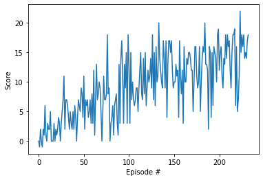

# Report
---
This project utilized the coding exercise for Deep Q-Networks algorithm as outlined in the [`solution/Deep_Q_Network_Solution.ipynd`](https://github.com/udacity/deep-reinforcement-learning/blob/master/dqn/solution/Deep_Q_Network_Solution.ipynb) solution.

## State and Action Space
The environment contains a single agent that navigates a large , square world.  At each time step, it has four actions:
- `0` - move forward 
- `1` - move backward
- `2` - turn left
- `3` - turn right

The state space has `37` dimensions and contains the agent's velocity, along with ray-based perception of objects around agent's forward direction.  


## Learning algorithm

The agent training utilized the `dqn` function in the navigation notebook. 

It continues episodical training via a dqn agent until `n_episodes` is reached or until the environment is solved. The environment is considered solved when the average reward (over the last 100 episodes) is at least 13.

Each episode continues until `max_t` time-steps is reached or until the environment says it's done.

A reward of `+1` is provided for collecting a yellow banana, and a reward of `-1` is provided for collecting a blue banana. 

The dqn_agent is contained in [`dqn_agent.py`](dqn_agent.py) 

For each time step the dqn_state acts on the current state and epsilon-greedy values. The dqn_agent utilize a replay buffer of experiences.

### DQN Hyper Parameters  

- n_episodes (int): maximum number of training episodes
- max_t (int): maximum number of timesteps per episode
- eps_start (float): starting value of epsilon, for epsilon-greedy action selection
- eps_end (float): minimum value of epsilon
- eps_decay (float): multiplicative factor (per episode) for decreasing epsilon

Where
`n_episodes=1000`, 
`max_t=10000`, 
`eps_start=0.5`, 
`eps_end=0.01` and
`eps_decay=0.98`

The epsilon-greedy values were found via trial and error after noticing that initial random actions could often lead to positive average rewards for early episodes.

There seemed no reason to have low number of episodes or timesteps, so reasonable high numbers were chosen.

### DQN Agent Hyper Parameters

- BUFFER_SIZE (int): replay buffer size
- BATCH_SIZ (int): mini batch size
- GAMMA (float): discount factor
- TAU (float): for soft update of target parameters
- LR (float): learning rate for optimizer
- UPDATE_EVERY (int): how often to update the network

Where 
`BUFFER_SIZE = int(1e6)`, 
`BATCH_SIZE = 128`, 
`GAMMA = 0.99`, 
`TAU = 1e-3`, 
`LR = 0.0001` and 
`UPDATE_EVERY = 2`  

The computer running this had 48 GB of ram, so buffer size and batch size was increased. GAMMA and TAU stayed at the default values. With Learning rate and update every updated by trial and error.

### Neural Network
The [QNetwork model](model.py) utilise 2 x 64 Fully Connected Layers with Relu activation followed by a final Fully Connected layer with the same number of units as the action size. The network has an initial dimension the same as the state size.   

## Plot of Rewards



```
Episode 100	Average Score: 5.27
Episode 200	Average Score: 11.62
Episode 233	Average Score: 13.05
Environment solved in 133 episodes!	Average Score: 13.05
```

## Ideas for Future Work

This project used the basic DQN algorithm. It can be improved by applying the following methods, which have been proved to overcome the weaknesses, especially the high bias of the basic DQN.

- double DQN
- dueling DQN
- prioritized experience replay
